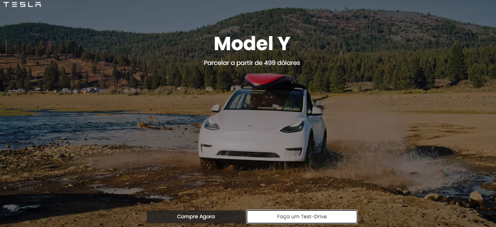

# Tesla Website

Este é um projeto de website desenvolvido como parte de uma aula na plataforma DevClub. O objetivo deste projeto é criar uma interface interativa para exibir diferentes modelos de carros da Tesla, com opções para compra e test-drive.



## Funcionalidades

- **Exibição de Modelos:** Mostra três modelos diferentes de carros da Tesla (Model Y, Model 3, Model X) com informações e vídeos/imagens.
- **Botões Interativos:** Inclui botões para "Compre Agora" e "Faça um Test-Drive".
- **Formulário de Compra:** Um formulário que aparece quando o botão "Compre Agora" é clicado.

## Tecnologias Utilizadas

- **HTML5:** Estrutura básica do site.
- **CSS3:** Estilos e layout do site.
- **JavaScript:** Funcionalidade interativa para exibir e ocultar o formulário.
- **Fontes do Google:** Usado para a fonte "Poppins".

## Estrutura do Projeto

```plaintext
.
├── img
│   ├── logo.png
│   ├── model-3.png
│   ├── model-x.png
│   ├── model-y.mp4
|   └── print.png
├── style.css
├── scripts.js
└── index.html

## Como Executar o projeto

- **Clone o Repositório:** git clone https://github.com/NEGuenther/devclub-tesla.git
- **Navegue até o diretório do projeto:** cd devclub-tesla
- **Abra o arquivo index.html no seu navegador:**

Você pode simplesmente arrastar e soltar o arquivo index.html em uma aba aberta do navegador ou usar o comando:

- **Copiar código**
- start index.html (No Windows)
- open index.html (No macOS)
- xdg-open index.html (No Linux)
